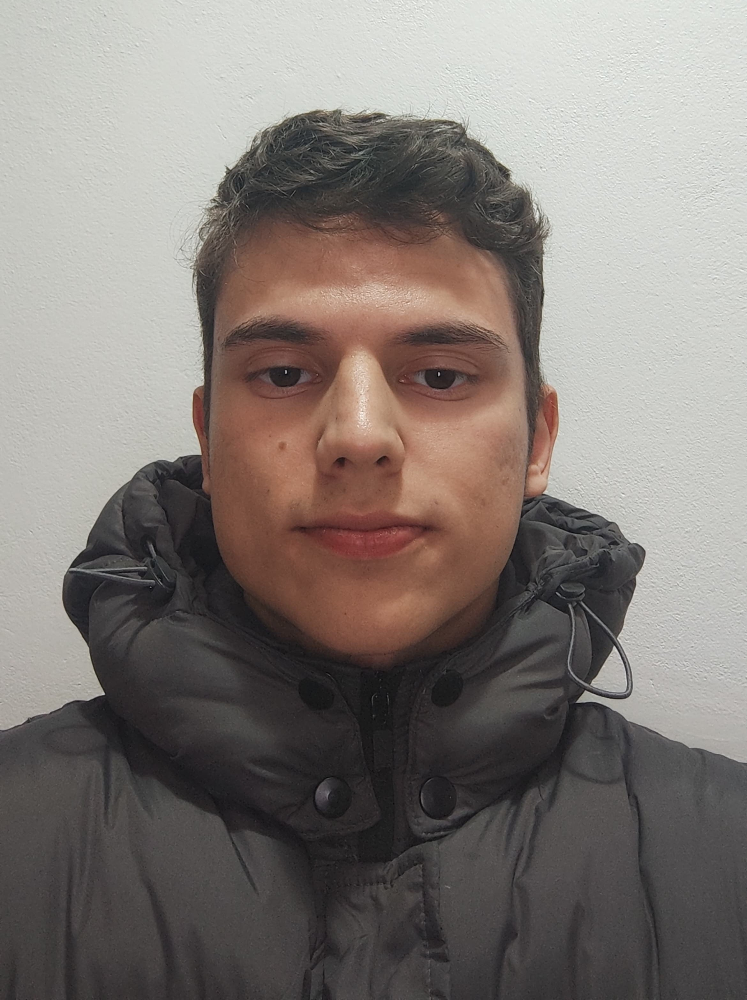
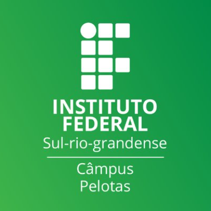
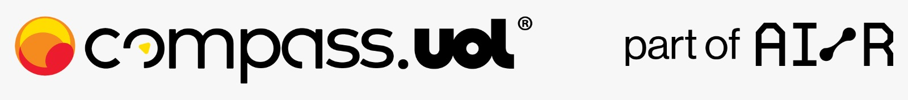

# Rodrigo Leitzke Bichet - Quality Engineering

## Sobre Mim

Olá! Meu nome é Rodrigo Leitzke Bichet e este repositório pertence a última challenge do programa de bolsas da Compass chamado Quality Engineering. Estou no 6º semestre do curso de Sistemas para Internet no IFSUL - Pelotas e tenho um grande interesse em Testes e QA. Fique feliz de mergulhar mais fundo nesse campo e contribuir com projetos inovadores que garantam a qualidade e a eficiência de produtos de software.

    
    
    

## Sobre o Repositório

### User Story da [API] Filmes

[Link para User Story da [API] Filmes aqui!](https://github.com/RodrigoBichet/API-Cinema-Testes/blob/main/UserStory/UserStoryFilme.md)

### User Story da [API] Ingressos

[Link para User Story da [API] Ingressos aqui!](https://github.com/RodrigoBichet/API-Cinema-Testes/blob/main/UserStory/UserStoryIngresso.md)

### Planejamento de Teste da [API] Filmes

[Link para Planejamento de Teste da [API] Filmes aqui!](https://github.com/RodrigoBichet/API-Cinema-Testes/blob/main/PlanejamentosDeTeste/PlanejamentoDeTesteFilme.md)

### Planejamento de Teste da [API] Ingressos

[Link para Planejamento de Teste da [API] Ingressos aqui!](https://github.com/RodrigoBichet/API-Cinema-Testes/blob/main/PlanejamentosDeTeste/PlanejamentoDeTesteIngressos.md)

## Tecnologias utilizadas e suas documentações e configurações de ambiente utilizadas nesse projeto!

### Documentação da [API]

[Link para toda documentação aqui!](LINK)

### Utilização do Mapa Mental

[Link para vídeo do Mapa Mental aqui!](https://gitlab.com/rodrigobichet/compassrodrigobichet/-/blob/pb_sprint2/Exercicios/Dia7Atividadecomplementar1.md?ref_type=heads)

### Documentação Postman

[Link para toda documentação aqui!](LINK)

### Documentação Playwright

[Link para toda documentação aqui!](LINK)

### Documentação Allure

[Link para toda documentação aqui!](LINK)

### Documentação K6

[Link para toda documentação aqui!](LINK)

## Vamos Juntos Nessa Jornada!

Acompanhe o progresso e participe dessa jornada de aprendizado e crescimento. Estou aberto a feedbacks e sugestões para melhorar continuamente.

---

Rodrigo Leitzke Bichet  
Programa Quality Engineering - Compass

---
